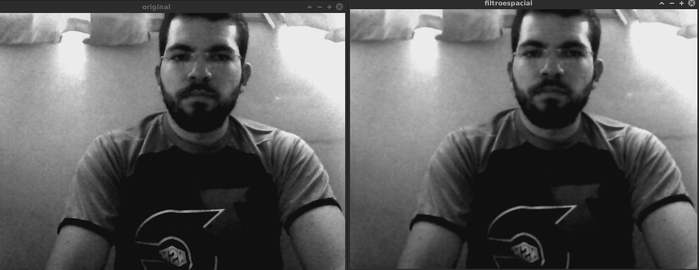
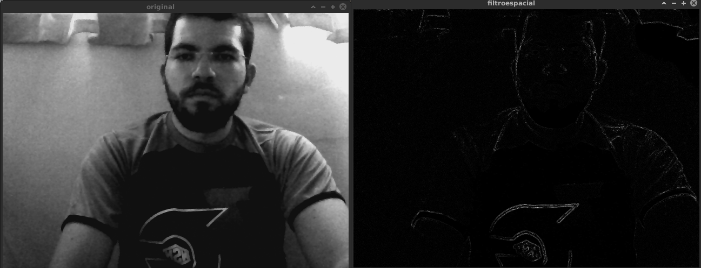
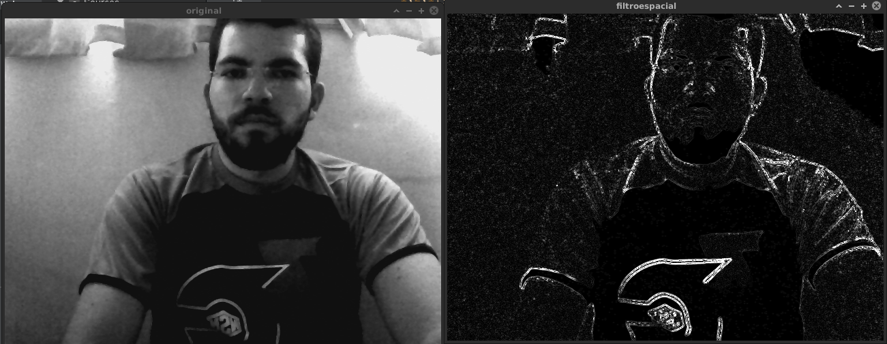

= Laplaciano do Gaussiano
Fellipe Augusto;Jessika Cristina
:source-highlighter: pygments

== Definição do problema
Deve-se implementar um filtro que realize o laplaciano da gaussiana de  imagens capturadas em um fluxo de vídeo.

== Solução proposta
Baseando-se no programa disponibilizado em
link:http://agostinhobritojr.github.io/tutoriais/pdi/#_exerc%C3%ADcios_4[Tutorial-PDI], foi implementada mais uma funcionalidade, a de implementar o laplaciano do gaussiano. O kernel desse filtro foi obtido em link:http://www2.ic.uff.br/~aconci/G-LoG.PDF[Filtro Gaussiano - UFF].

.lapgauss.cpp
[source,cpp]
----
#include <iostream>
#include <opencv2/opencv.hpp>

using namespace cv;
using namespace std;

void printmask(Mat &m){
  for(int i=0; i<m.size().height; i++){
    for(int j=0; j<m.size().width; j++){
      cout << m.at<float>(i,j) << ",";
    }
    cout << endl;
  }
}

void menu(){
  cout << "\npressione a tecla para ativar o filtro: \n"
    "a - calcular modulo\n"
    "m - media\n"
    "g - gauss\n"
    "v - vertical\n"
    "h - horizontal\n"
    "l - laplaciano\n"
    "e - LoG\n "
    "esc - sair\n";
}

int main(int argvc, char** argv){
  VideoCapture video;
  float media[] = {1,1,1,
                   1,1,1,
                   1,1,1};
  float gauss[] = {1,2,1,
                   2,4,2,
                   1,2,1};
  float horizontal[]={-1,0,1,
                      -2,0,2,
                      -1,0,1};
  float vertical[]={-1,-2,-1,
                    0,0,0,
                    1,2,1};
  float laplacian[]={0,-1,0,
                     -1,4,-1,
                     0,-1,0};
  float LoG[]={0,0,-1,0,0,
               0,-1,-2,-1,0,
               -1,-2,16,-2,-1,
               0,-1,-2,-1,0,
               0,0,-1,0,0 };

  Mat cap, frame, frame32f, frameFiltered;
  Mat mask(3,3,CV_32F), mask1;
  Mat result, result1;
  //Mat auxMask(5,5,CV_32F);
  double width, height, min, max;
  int absolut;
  char key;

  video.open(0);
  if(!video.isOpened())
    return -1;
  width=video.get(CV_CAP_PROP_FRAME_WIDTH);
  height=video.get(CV_CAP_PROP_FRAME_HEIGHT);
  std::cout << "largura=" << width << "\n";;
  std::cout << "altura =" << height<< "\n";;

  namedWindow("filtroespacial",1);

  mask = Mat(3, 3, CV_32F, media);

  scaleAdd(mask, 1/9.0, Mat::zeros(3,3,CV_32F), mask1);
  swap(mask, mask1);
  absolut=1; // calcs abs of the image

  menu();
  for(;;){
    video >> cap;
    cvtColor(cap, frame, CV_BGR2GRAY);
    flip(frame, frame, 1);
    imshow("original", frame);
    frame.convertTo(frame32f, CV_32F);
    filter2D(frame32f, frameFiltered, frame32f.depth(), mask, Point(1,1), 0);
    if(absolut){
      frameFiltered=abs(frameFiltered);
    }
    frameFiltered.convertTo(result, CV_8U);
    imshow("filtroespacial", result);
    key = (char) waitKey(10);
    if( key == 27 ) break; // esc pressed!
    switch(key){
    case 'a':
      menu();
      absolut=!absolut;
      break;
    case 'm':
      menu();
      mask = Mat(3, 3, CV_32F, media);
      scaleAdd(mask, 1/9.0, Mat::zeros(3,3,CV_32F), mask1);
      mask = mask1;
      printmask(mask);
      break;
    case 'g':
      menu();
      mask = Mat(3, 3, CV_32F, gauss);
      scaleAdd(mask, 1/16.0, Mat::zeros(3,3,CV_32F), mask1);
      mask = mask1;
      printmask(mask);
      break;
    case 'h':
      menu();
      mask = Mat(3, 3, CV_32F, horizontal);
      printmask(mask);
      break;
    case 'v':
      menu();
      mask = Mat(3, 3, CV_32F, vertical);
      printmask(mask);
      break;
    case 'l':
      menu();
      mask = Mat(3, 3, CV_32F, laplacian);
      printmask(mask);
      break;
    case 'e':
        menu();
        mask=Mat(5,5,CV_32F,LoG);
        printmask(mask);
        break;
    default:
      break;
    }
  }
  return 0;
}
----

As linhas

[source,cpp]
----
  float LoG[]={0,0,-1,0,0,
               0,-1,-2,-1,0,
               -1,-2,16,-2,-1,
               0,-1,-2,-1,0,
               0,0,-1,0,0 };
----
Definem o kernel do filtro Laplaciano do Gaussiano (LoG). Esse filtro tem como objetivo realizar a eliminação de ruído gaussiano e detectar bordas.

[source,cpp]
----
    case 'e':
        menu();
        mask=Mat(5,5,CV_32F,LoG);
        printmask(mask);
        break;
----
Para selecionar esse filtro, o usuário deve digitar a tecla 'e', e o kernel LoG será passado como parâmetro para a função `filter2d()`

== Resultados e considerações Finais
A seguir são feitas comparações com os resultados dos Filtros Gaussiano, Laplaciano e Laplaciano do Gaussiano.

.Filtro Gaussiano

.Filtro Laplaciano

.Filtro LoG

