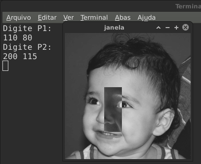

= Negativo de uma imagem
Fellipe Augusto; Jessika Cristina
:source-highlighter: pygments

== Definição do problema
Deve-se iplementar um programa que permita ao usuário inserir as coordenadas de dois pontos (P~1~ e P~2~) de uma imagem. Deve-se então, tirar o "negativo" dos pixels inseridos dentro da área retangular definida por esses dois pontos.

== Solução proposta
Segue programa proposto:

.negativo.cpp
[source,cpp]
----
#include <iostream>
#include <opencv2/opencv.hpp>

using namespace std;
using namespace cv;

int main(){
    Mat image;
    int rows;
    int cols;
    int p1[2];
    int p2[2];
    image=imread("biel.png",CV_LOAD_IMAGE_GRAYSCALE);
    if(!image.data)
        cout<<"nao abriu arquivo"<<endl;
    namedWindow("janela",WINDOW_AUTOSIZE);
    rows=image.rows;
    cols=image.cols;
    cout<<"Digite P1:"<<endl;
    cin>>p1[0]>>p1[1];
    cout<<"Digite P2:"<<endl;
    cin>>p2[0]>>p2[1];
    for(int x=p1[0];x<=p2[0];x++){
        for(int y=p1[1];y<=p2[1];y++){
            image.at<uchar>(x,y)=255-image.at<uchar>(x,y); //operação de fazer o negativo

        }
    }
    imshow("janela", image);
    waitKey();
    return 0;
}
----
A parte central do programa está na linha:
[source,cpp]
----
image.at<uchar>(x,y)=255-image.at<uchar>(x,y);
----
Onde se realiza a operação de subtrair 255 (valor máximo do nível de cinza considerando valores do tipo `uchar`) do nível original da imagem.

== Resultados e Considerações Finais
Temos a imagem original:

.Imagem de Entrada do programa
image::../imgs/biel.png[]

E  a saída do programa é mostrada a seguir, exibindo as coordenadas dos pontos da área retangular a ter seu negativo executado.

.Saída do programa

É necessária ainda a implementação de uma sub-rotina para checar se o usuário digitou coordenadas válidas.
